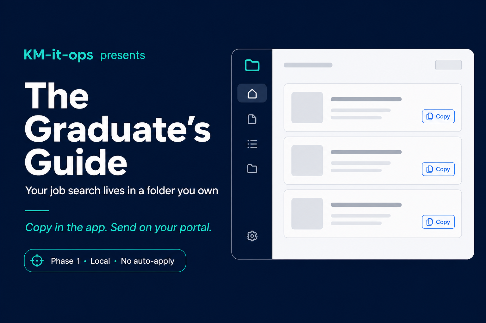
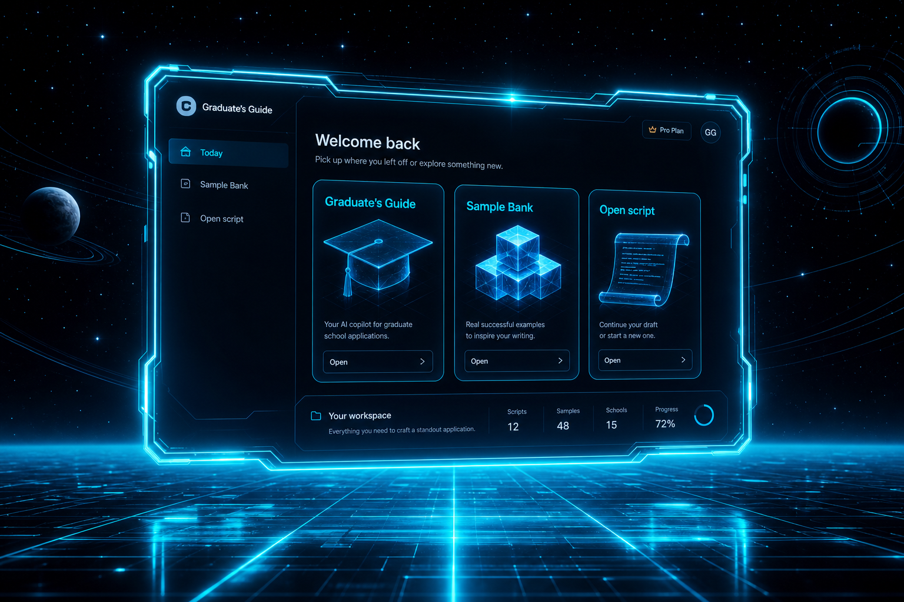

<picture>
  <source media="(prefers-color-scheme: dark)" srcset="docs/assets/social-card.png" />
  
</picture>

<div align="center">

# The Graduate's Guide

### Your job search lives in a folder **you own**.

Privacy-first **Tauri** desktop by **[KM-it-ops](https://github.com/KM-it-ops)** · Phase 1

[](https://github.com/KM-it-ops/graduates-guide-desktop/releases)
[](LICENSE)
[](https://tauri.app/)
[](landing/index.html)



<sub><strong>Illustration only</strong> — sanitized fixture data · <strong>Copy</strong> + <strong>Open script</strong> in-app · you Send/Submit externally</sub>

<br /><br />

[**Download**](https://github.com/KM-it-ops/graduates-guide-desktop/releases) · [**Landing page**](landing/index.html) · [**Develop**](#develop)

</div>

---

## What ships in Phase 1

| | |
|:--|:--|
| **Vault import** | Shipped |
| **Today · Queue · Follow-ups** | Shipped |
| **Script reader + Copy** | Shipped |
| **Apply assist** | Shipped |
| **Evaluate / Generate in-app** | Stub — use engine CLI |
| **In-app Send / auto-apply** | Not offered (by design) |

## Why it exists

You need the words **before** the interview — not another agent chewing through your machine. A calm shell around a local markdown vault: what to do today, ranked queue, paste-ready scripts.

<table>
<tr>
<td width="50%">

**What you get**
- Today — max 5 missions, one priority
- Queue — ranked from your vault
- Scripts — Copy button, not in-app Send
- Apply assist — portal + script side by side

</td>
<td width="50%">

**What it is not**
- Auto-apply bots
- Hosted CV storage
- Full CLI parity inside Tauri yet

</td>
</tr>
</table>

## Privacy

| | |
|:--|:--|
| Vault on disk | You pick the folder |
| Accounts | None required |
| Telemetry | Off in Phase 1 |
| API keys | OS keychain only |
| Crash reports | Opt-in |

## Develop

```bash
git clone https://github.com/KM-it-ops/graduates-guide-desktop.git
cd graduates-guide-desktop
git submodule update --init --recursive
cd engine && npm install && cd ..
npm install
npm run tauri:dev
```

First launch → **Import vault** → your folder, or `fixtures/sanitized-vault/` for a safe demo.

| Command | Purpose |
|---------|---------|
| `npm run tauri:dev` | Dev shell |
| `npm run tauri:build` | Release installer |
| `npm test` | Vitest |
| `npm run privacy-audit` | No HTTP caps / telemetry deps |

## More

- [Migrate from CLI](docs/migrate-from-cli.md) · [Engine updates](docs/engine-update.md)

## License

MIT — see [LICENSE](LICENSE).

## Acknowledgments

Bundled evaluation engine includes MIT-licensed code from [career-ops](https://github.com/santifer/career-ops). **The Graduate's Guide** is independent and not affiliated with that project.
